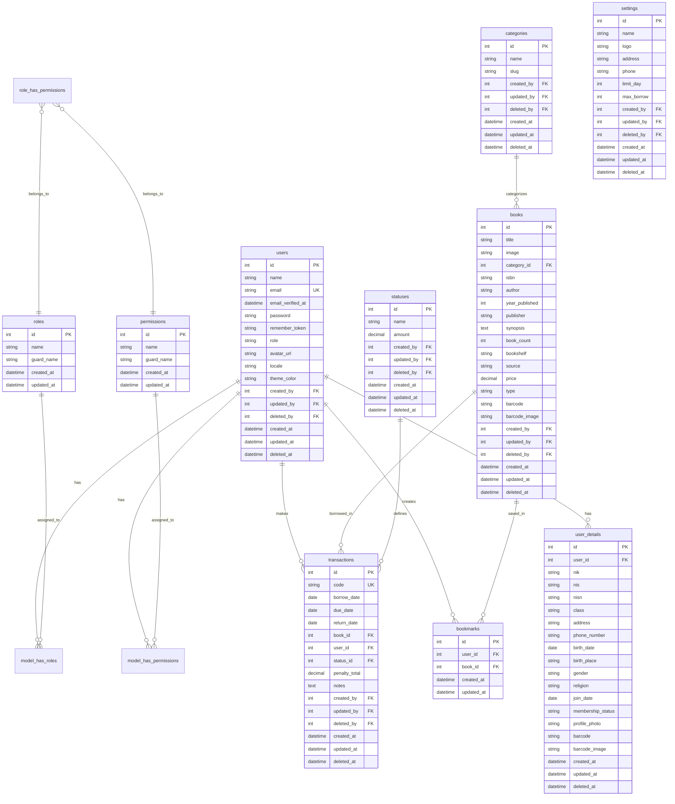

# Perpus11 - Sistem Manajemen Perpustakaan

<p align="center">
  
  
</p>

<p align="center">
  <a href="https://github.com/laravel/framework"></a>
  <a href="https://filamentphp.com"></a>
  <a href="https://php.net"></a>
  <a href="https://sqlite.org"></a>
</p>

Sistem manajemen perpustakaan modern berbasis web yang dibangun dengan Laravel 12 dan Filament 4. Aplikasi ini menyediakan fitur lengkap untuk mengelola peminjaman buku, anggota, katalog buku, dan transaksi perpustakaan dengan antarmuka admin yang intuitif.

## Daftar Isi

- [Fitur Utama](#fitur-utama)
- [Teknologi](#teknologi)
- [Kebutuhan Sistem](#kebutuhan-sistem)
- [Instalasi](#instalasi)
- [Konfigurasi](#konfigurasi)
- [ERD Database](#erd-database)
- [Penggunaan](#penggunaan)
- [Command Kustom](#command-kustom)
- [Struktur Proyek](#struktur-proyek)
- [Testing](#testing)
- [Troubleshooting](#troubleshooting)
- [Deployment](#deployment)
- [Kontribusi](#kontribusi)
- [Lisensi](#lisensi)

---

## Fitur Utama

### Manajemen Buku
- CRUD lengkap untuk katalog buku
- Upload gambar cover buku
- Generate barcode otomatis untuk setiap buku
- Kategorisasi buku
- Manajemen stok eksemplar
- Informasi detail: ISBN, penulis, penerbit, tahun terbit, sinopsis
- Soft delete dengan restore

### Manajemen Anggota
- Registrasi anggota (siswa/guru/staf)
- Generate QR Code untuk kartu anggota
- Informasi lengkap: NIS, NISN, kelas, alamat, kontak
- Status keanggotaan (aktif/tidak aktif)
- Bookmark buku favorit
- Edit profil oleh user

### Manajemen Peminjaman
- Transaksi peminjaman buku
- Konfirmasi peminjaman oleh admin
- Pengembalian buku dengan berbagai status:
  - Dikembalikan (baik)
  - Hilang (denda Rp 50.000)
  - Rusak Ringan (denda Rp 5.000)
  - Rusak Berat (denda Rp 10.000)
- Perhitungan denda keterlambatan otomatis
- Tracking status peminjaman
- Catatan khusus per transaksi

### Sistem Notifikasi
- Notifikasi otomatis untuk buku terlambat
- Pengiriman email ke anggota
- Notifikasi di database
- Scheduled task berjalan setiap hari jam 09:00

### Barcode & QR Code
- Generate barcode untuk buku (Code128)
- Generate QR Code untuk kartu anggota
- Scan barcode untuk transaksi cepat
- Storage terpisah untuk user dan book barcodes

### Dashboard Admin
- Statistik perpustakaan real-time
- Widget: total buku, buku dipinjam, buku tersedia
- Widget: buku terlambat, total anggota
- Transaksi terbaru
- Grafik statistik

### Fitur Lainnya
- Export data ke Excel/CSV
- Role & Permission management (Filament Shield)
- Multi-language support
- Responsive design
- Dark mode support
- Audit trail (created_by, updated_by, deleted_by)
- Soft delete untuk data penting

---

## Teknologi

### Backend
- **Laravel 12.x** - Framework PHP
- **PHP 8.2+** - Bahasa pemrograman
- **SQLite** - Database (dapat diubah ke MySQL/PostgreSQL)

### Frontend
- **Filament 4.x** - Admin Panel Framework
- **Livewire 3.x** - Full-stack Framework
- **Tailwind CSS 4.x** - CSS Framework
- **DaisyUI 5.x** - Component Library
- **Alpine.js** - JavaScript Framework (included dengan Livewire)

### Packages Utama
| Package | Versi | Kegunaan |
|---------|-------|----------|
| filament/filament | ^4.0 | Admin Panel |
| bezhansalleh/filament-shield | ^4.0 | Role & Permissions |
| alperenersoy/filament-export | ^4.0 | Export Excel/CSV |
| jeffersongoncalves/filament-qrcode-field | ^2.0 | QR Code Generator |
| milon/barcode | ^12.0 | Barcode Generator |
| jantinnerezo/livewire-alert | ^4.0 | SweetAlert2 Notifications |
| joaopaulolndev/filament-edit-profile | ^2.0 | Edit Profile Page |
| wildside/userstamps | ^3.1 | Audit Trail (created_by, etc) |

### Development Tools
- **Laravel Pint** - Code Formatting
- **Laravel Boost** - MCP Server untuk development
- **PHPUnit 11.x** - Testing Framework
- **Rector** - Automated Refactoring

---

## Kebutuhan Sistem

### Minimum Requirements
- **PHP**: 8.2 atau lebih tinggi
- **Composer**: 2.x atau lebih tinggi
- **Node.js**: 18.x atau lebih tinggi
- **NPM**: 9.x atau lebih tinggi
- **Database**: SQLite 3.x (default) / MySQL 5.7+ / PostgreSQL 10+

### PHP Extensions
- BCMath
- Ctype
- cURL
- DOM
- Fileinfo
- JSON
- Mbstring
- OpenSSL
- PCRE
- PDO
- Tokenizer
- XML
- GD (untuk image processing)
- SQLite (jika menggunakan SQLite)

### Recommended
- RAM: 2GB atau lebih
- Disk Space: 500MB atau lebih
- CPU: Dual core atau lebih

---

## Instalasi

### Quick Install (Otomatis)

Clone repository dan jalankan script setup:

```bash
# Clone repository
git clone <repository-url>
cd perpus11

# Jalankan setup otomatis
composer run setup
```

Script ini akan:
1. Menginstall dependency PHP
2. Copy `.env.example` ke `.env`
3. Generate application key
4. Menjalankan migration
5. Install dependency JavaScript
6. Build assets untuk production

### Manual Install

#### 1. Clone Repository

```bash
git clone <repository-url>
cd perpus11
```

#### 2. Install PHP Dependencies

```bash
composer install
```

#### 3. Setup Environment

```bash
# Copy file environment
cp .env.example .env

# Generate application key
php artisan key:generate
```

#### 4. Konfigurasi Database

Edit file `.env`:

```env
# Untuk SQLite (default)
DB_CONNECTION=sqlite

# Untuk MySQL
# DB_CONNECTION=mysql
# DB_HOST=127.0.0.1
# DB_PORT=3306
# DB_DATABASE=perpus11
# DB_USERNAME=your_username
# DB_PASSWORD=your_password

# Untuk PostgreSQL
# DB_CONNECTION=pgsql
# DB_HOST=127.0.0.1
# DB_PORT=5432
# DB_DATABASE=perpus11
# DB_USERNAME=your_username
# DB_PASSWORD=your_password
```

Buat file database jika menggunakan SQLite:

```bash
touch database/database.sqlite
```

#### 5. Jalankan Migration

```bash
php artisan migrate --force
```

#### 6. Install Frontend Dependencies

```bash
npm install
```

#### 7. Build Assets

```bash
# Production build
npm run build

# Atau development build
npm run dev
```

#### 8. Link Storage (Untuk File Uploads)

```bash
php artisan storage:link
```

#### 9. Jalankan Database Seeder

```bash
php artisan db:seed
```

Ini akan menjalankan semua seeder yang telah disiapkan:
- **RoleAndPermissionSeeder**: Membuat roles & permissions (Filament Shield)
- **LibrarySystemSeeder**: Membuat users, user details, dan QR codes
- **SettingSeeder**: Konfigurasi pengaturan perpustakaan
- **StatusSeeder**: Data status transaksi (Menunggu, Dipinjam, dll)
- **BookSeeder**: Data buku sample (online/offline mode)
- **TransactionSeeder**: Data transaksi sample

**Akun untuk Login (Password: `password`):**

| Role | Email | Keterangan |
|------|-------|------------|
| 👑 Super Admin | admin@testing.com | System maintenance only |
| 📚 Ketua Perpustakaan | ketua@testing.com | Akses penuh |
| 👨‍💼 Petugas | petugas1@testing.com<br>petugas2@testing.com<br>staff@testing.com | Operasional |
| 👨‍🎓 Siswa | siswa@testing.com<br>siswa2@testing.com<br>anggota@testing.com | User biasa |

> **Catatan**: Seeder juga akan membuat user tambahan dengan factory, sehingga total user yang dibuat adalah sekitar 19 user dengan berbagai status keanggotaan.

---

## Konfigurasi

### Pengaturan Aplikasi

Edit file `.env` untuk mengatur konfigurasi:

```env
APP_NAME="Perpus11"
APP_ENV=local
APP_KEY=base64:...
APP_DEBUG=true
APP_URL=http://localhost:8000

# Timezone
TZ=Asia/Jakarta

# Locale
APP_LOCALE=id
APP_FALLBACK_LOCALE=en
```

### Konfigurasi Filament

```env
FILAMENT_FILESYSTEM_DISK=public
```

### Konfigurasi Queue

Untuk notifikasi email yang efisien:

```env
QUEUE_CONNECTION=database
```

Jalankan migration untuk jobs table:

```bash
php artisan queue:table
php artisan migrate
```

### Konfigurasi Mail

Untuk fitur notifikasi email:

```env
MAIL_MAILER=smtp
MAIL_HOST=mailhog
MAIL_PORT=1025
MAIL_USERNAME=null
MAIL_PASSWORD=null
MAIL_ENCRYPTION=null
MAIL_FROM_ADDRESS="noreply@perpus11.com"
MAIL_FROM_NAME="${APP_NAME}"
```

---

## ERD Database



### Penjelasan Tabel

| Tabel | Deskripsi |
|-------|-----------|
| `users` | Data user/login (admin, siswa, guru) |
| `user_details` | Detail profil lengkap anggota |
| `categories` | Kategori buku |
| `books` | Katalog buku |
| `statuses` | Status transaksi (Menunggu, Dipinjam, Terlambat, dll) |
| `transactions` | Transaksi peminjaman/pengembalian |
| `bookmarks` | Buku yang disimpan anggota |
| `settings` | Pengaturan perpustakaan |
| `roles` | Role user (Filament Shield) |
| `permissions` | Permission user (Filament Shield) |

---

## Penggunaan

### Menjalankan Server

#### Development Mode (Hot Reload)

```bash
composer run dev
```

Ini akan menjalankan:
- Laravel server di port 8000
- Vite dev server untuk frontend
- Queue worker
- Log viewer (Pail)

#### Production Mode

```bash
php artisan serve
```

Aplikasi akan tersedia di `http://localhost:8000`

### Login Admin

1. Buka `http://localhost:8000/admin`
2. Login dengan kredensial admin yang dibuat
3. Dashboard akan muncul

### Alur Kerja Peminjaman

#### 1. Registrasi Anggota
- Admin mendaftarkan anggota baru
- Sistem generate QR Code otomatis
- Status keanggotaan: Aktif/Tidak Aktif

#### 2. Tambah Buku
- Admin menambah buku ke katalog
- Barcode generated otomatis
- Set stok eksemplar

#### 3. Peminjaman Buku (Oleh Anggota)
- Anggota login dan pilih buku
- Buat request peminjaman
- Status: "Menunggu Persetujuan"

#### 4. Konfirmasi Peminjaman (Oleh Admin)
- Admin review request
- Cek eligibility (max borrow, membership status)
- Konfirmasi peminjaman
- Status: "Dipinjam"

#### 5. Pengembalian Buku
- Admin klik "Kembalikan"
- Pilih status pengembalian:
  - Dikembalikan (baik)
  - Hilang
  - Rusak Ringan
  - Rusak Berat
- Denda otomatis dihitung
- Status berubah sesuai pilihan

### Status Transaksi

| Status | Deskripsi | Denda |
|--------|-----------|-------|
| Menunggu Persetujuan | Request peminjaman baru | Rp 0 |
| Dipinjam | Buku sedang dipinjam | - |
| Terlambat | Lewat tanggal pengembalian | Rp 500/hari |
| Dikembalikan | Buku dikembalikan baik | Rp 0 |
| Hilang | Buku hilang | Rp 50.000 |
| Rusak Ringan | Buku rusak ringan | Rp 5.000 |
| Rusak Berat | Buku rusak berat | Rp 10.000 |
| Tolak | Peminjaman ditolak admin | Rp 0 |
| Dibatalkan | Dibatalkan oleh anggota | Rp 0 |

---

## Command Kustom

### books:check-overdue

Cek buku terlambat dan kirim notifikasi.

```bash
# Cek buku terlambat (dry-run, tanpa kirim notifikasi)
php artisan books:check-overdue --dry-run --detailed

# Kirim notifikasi untuk buku terlambat >= 1 hari
php artisan books:check-overdue

# Kirim notifikasi untuk buku terlambat >= 3 hari
php artisan books:check-overdue --days=3
```

**Options:**
- `--days=1`: Minimum hari keterlambatan (default: 1)
- `--dry-run`: Mode simulasi tanpa kirim notifikasi
- `--detailed`: Tampilkan output detail (tabel)

**Output:**
```
Checking for overdue books (minimum 1 day(s) overdue)...
Found 3 overdue book(s).

┌────┬──────────┬────────────────────┬────────────┬──────────────┬──────────┐
│ ID │ User     │ Book               │ Due Date   │ Days Overdue │ Penalty  │
├────┼──────────┼────────────────────┼────────────┼──────────────┼──────────┤
│ 1  │ Ahmad    │ Laskar Pelangi     │ 2024-12-20 │ 5            │ Rp 5,000 │
│ 2  │ Siti     │ Bumi Manusia       │ 2024-12-22 │ 3            │ Rp 3,000 │
│ 3  │ Budi     │ Pulang             │ 2024-12-23 │ 2            │ Rp 2,000 │
└────┴──────────┴────────────────────┴────────────┴──────────────┴──────────┘

Notifications sent: 3/3
```

### lib:regenerate-qr-codes

Regenerate QR Code untuk user dan buku.

```bash
# Regenerate semua QR codes
php artisan lib:regenerate-qr-codes

# Regenerate untuk user tertentu
php artisan lib:regenerate-qr-codes --user-id=5
```

**Output:**
```
🔄 Regenerating QR codes as files...
📱 Regenerating QR codes for 25 users...
   ✅ Ahmad Dani: USER-2024-001
      📁 user_barcode/user_1_20241201.png
   ✅ Suti Rahma: USER-2024-002
      📁 user_barcode/user_2_20241201.png
   ...

✅ QR code regeneration completed!

📁 Storage Information:
═══════════════════════════════════════════════════════════
   📱 User QR codes: 25 files in user_barcode/
   📚 Book QR codes: 150 files in book_barcode/
═══════════════════════════════════════════════════════════
```

### Schedule List

Lihat semua scheduled tasks.

```bash
php artisan schedule:list
```

**Output:**
```
0 9 * * *  php artisan books:check-overdue .. Next Due: 16 jam dari sekarang
```

---

## Struktur Proyek

```
perpus11/
├── app/
│   ├── Console/
│   │   └── Commands/
│   │       ├── CheckOverdueBooks.php      # Command cek buku terlambat
│   │       └── RegenerateQRCodes.php       # Command regenerate QR
│   ├── Filament/
│   │   ├── Pages/
│   │   │   └── ManageSetting.php           # Halaman pengaturan
│   │   ├── Resources/
│   │   │   ├── Books/                      # Resource buku
│   │   │   │   ├── Pages/
│   │   │   │   ├── Schemas/
│   │   │   │   └── Tables/
│   │   │   ├── Categories/                 # Resource kategori
│   │   │   ├── Transactions/               # Resource transaksi
│   │   │   └── Users/                      # Resource user
│   │   └── Widgets/
│   │       ├── LibraryStatsWidget.php      # Widget statistik
│   │       ├── OverdueBooksWidget.php      # Widget buku terlambat
│   │       └── RecentTransactionsWidget.php # Widget transaksi
│   ├── Models/
│   │   ├── Book.php
│   │   ├── Category.php
│   │   ├── Status.php
│   │   ├── Transaction.php
│   │   ├── User.php
│   │   └── UserDetail.php
│   ├── Notifications/
│   │   └── OverdueBookNotification.php     # Notifikasi buku terlambat
│   └── Services/
│       ├── BarcodeService.php              # Service generate barcode
│       ├── BarcodeScannerService.php       # Service scan barcode
│       ├── BookmarkService.php             # Service bookmark
│       └── TransactionService.php          # Service transaksi
├── bootstrap/
│   └── app.php                             # Application configuration
├── database/
│   ├── migrations/                         # Database migrations
│   └── seeders/                            # Database seeders
├── public/
│   └── storage/                            # Symbolic link ke storage
├── resources/
│   └── views/                              # Blade templates
├── routes/
│   ├── console.php                         # Console routes & schedules
│   └── web.php                             # Web routes
├── storage/
│   └── app/public/
│       ├── user_barcode/                   # QR Code user
│       └── book_barcode/                   # Barcode buku
├── tests/
│   ├── Feature/                            # Feature tests
│   └── Unit/                               # Unit tests
├── .env                                   # Environment configuration
├── composer.json                          # PHP dependencies
└── package.json                           # NPM dependencies
```

---

## Testing

### Menjalankan Semua Test

```bash
php artisan test
```

### Menjalankan Test Tertentu

```bash
# Test file tertentu
php artisan test tests/Feature/BookManagementTest.php

# Test dengan filter nama
php artisan test --filter=test_user_can_borrow_book
```

### Test Types

1. **Feature Tests**: Test fitur lengkap (HTTP request, database)
2. **Unit Tests**: Test unit kecil (service, model)

---

## Troubleshooting

### Error: "Database not found"

Buat file database SQLite:

```bash
touch database/database.sqlite
```

### Error: "Storage link not working"

Hapus symbolic link lama dan buat baru:

```bash
rm public/storage
php artisan storage:link
```

### Error: "Permission denied"

Set permission yang benar:

```bash
chmod -R 775 storage bootstrap/cache
```

### Error: "Vite manifest not found"

Build frontend assets:

```bash
npm run build
```

### Error: "Queue not processing"

Jalankan queue worker:

```bash
php artisan queue:work
```

### Lihat Logs

```bash
# Laravel logs
tail -f storage/logs/laravel.log

# Menggunakan Pail (real-time)
php artisan pail
```

### Clear Cache

```bash
# Clear application cache
php artisan cache:clear

# Clear configuration cache
php artisan config:clear

# Clear route cache
php artisan route:clear

# Clear view cache
php artisan view:clear

# Clear all caches
php artisan optimize:clear
```

---

## Deployment

### Production Checklist

- [ ] Set `APP_ENV=production` di `.env`
- [ ] Set `APP_DEBUG=false` di `.env`
- [ ] Set encryption key yang kuat
- [ ] Configure database (MySQL/PostgreSQL recommended)
- [ ] Run `php artisan key:generate`
- [ ] Run `php artisan migrate --force`
- [ ] Run `php artisan config:cache`
- [ ] Run `php artisan route:cache`
- [ ] Run `php artisan view:cache`
- [ ] Set up queue worker dengan supervisor
- [ ] Set up cron job untuk scheduler
- [ ] Configure backup database
- [ ] Enable HTTPS
- [ ] Set firewall rules

### Build Assets

```bash
npm run build
```

### Optimize Composer

```bash
composer install --optimize-autoloader --no-dev
```

### Scheduler Configuration

Untuk menjalankan scheduler secara otomatis, tambahkan cron job ke server:

```bash
* * * * * cd /path-to-your-project && php artisan schedule:run >> /dev/null 2>&1
```

Scheduler akan menjalankan command `books:check-overdue` setiap hari jam 09:00.

### Local Development Scheduler

Untuk testing scheduler secara lokal:

```bash
php artisan schedule:work
```

---

## Kontribusi

Contributions, issues, and feature requests are welcome!

1. Fork the repository
2. Create your feature branch (`git checkout -b feature/AmazingFeature`)
3. Commit your changes (`git commit -m 'Add some AmazingFeature'`)
4. Push to the branch (`git push origin feature/AmazingFeature`)
5. Open a Pull Request

---

## Credits

- [Laravel](base64:9PgCQ/FAKUN+aL+VWUwcsK6r4rhxPRLVqehA/Kp2su8=) - The PHP Framework For Web Artisans
- [Filament](https://filamentphp.com) - The elegant admin panel for Laravel
- [Tailwind CSS](https://tailwindcss.com) - A utility-first CSS framework
- [DaisyUI](https://daisyui.com) - Tailwind CSS Components

---

## License

This project is open-sourced software licensed under the [MIT license](https://opensource.org/licenses/MIT).

---

## Support

Untuk pertanyaan atau bantuan, silakan:
- Open issue di GitHub repository
- Email: support@example.com
- Documentation: [Link ke Wiki/Dokumentasi]

---

**Made with ❤️ using Laravel & Filament**
