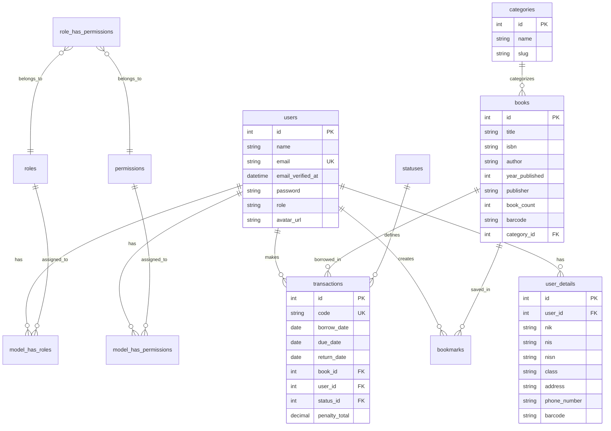
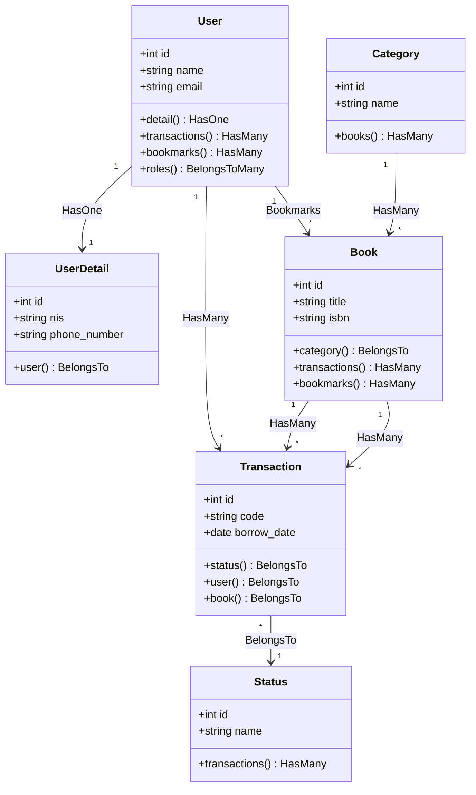
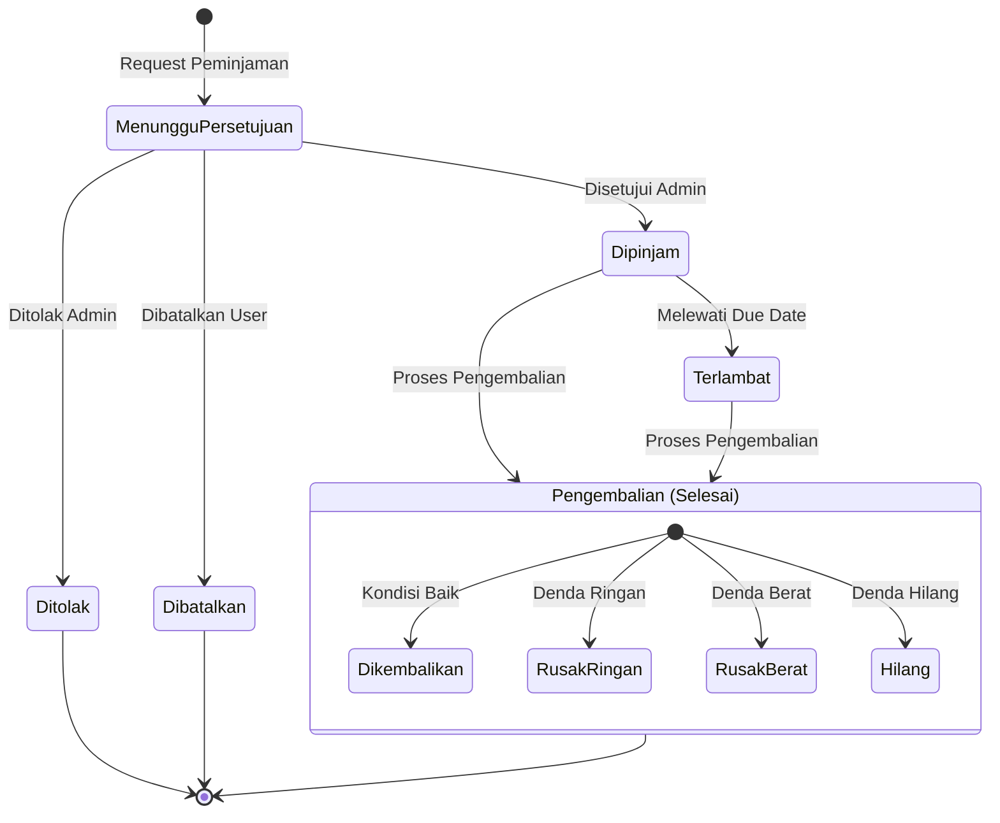
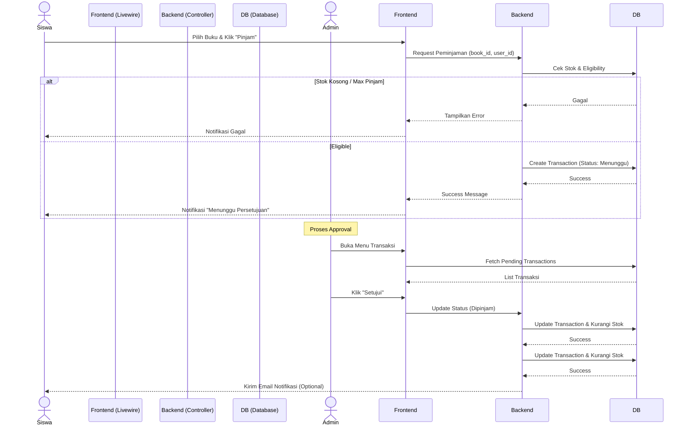
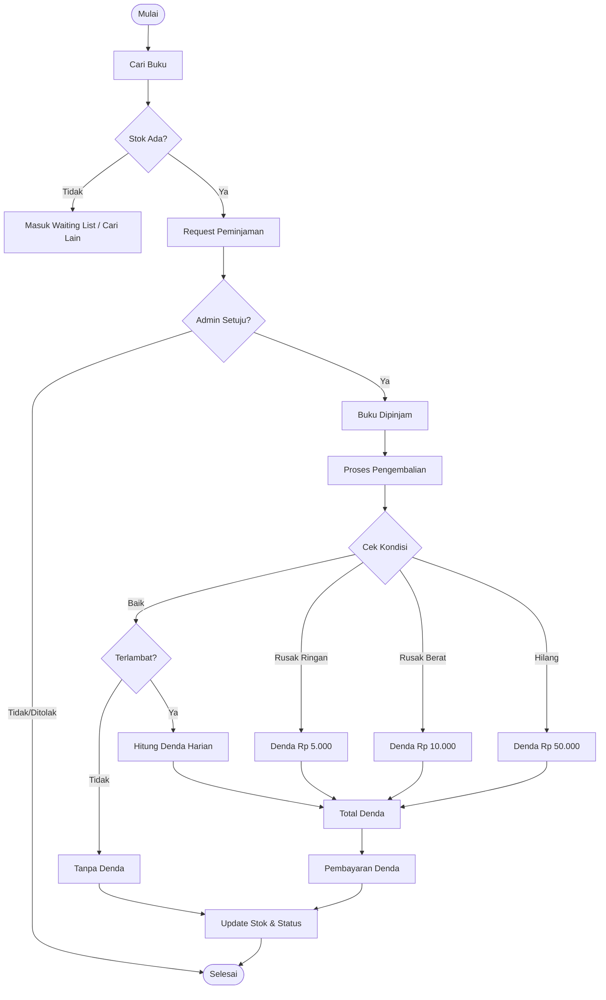

# Technical Documentation

## Tech Stack

### Core Technologies
- **Backend**: Laravel 12.x, PHP 8.2+, SQLite.
- **Frontend**: Filament 4.x, Livewire 3.x, Tailwind CSS 4.x, DaisyUI 5.x, Alpine.js.

### Key Packages
- `filament/filament`: Admin Panel & Form Builder.
- `bezhansalleh/filament-shield`: Role & Permission Management.
- `alperenersoy/filament-export`: Excel/CSV Data Export.
- `jeffersongoncalves/filament-qrcode-field`: QR Code Input/Display.
- `milon/barcode`: 1D Barcode Generator.
- `jantinnerezo/livewire-alert`: SweetAlert2 wrapper for Livewire.
- `wildside/userstamps`: Record creator/updater tracking.

---

## Database Schema (ERD)

### Ringkasan Relasi
- `Users` memiliki relasi `hasOne` ke `UserDetails`.
- `Books` dikategorikan oleh `Categories` (`belongsTo`).
- `Transactions` menghubungkan `Users` (peminjam) dan `Books` (objek).
- `Transactions` memiliki `Status` (Menunggu, Dipinjam, Kembali, dll).

### Struktur Tabel Utama

#### `users`
Menyimpan data otentikasi.
- `id`, `name`, `email`, `password`, `role`.

#### `user_details`
Menyimpan profil lengkap anggota perpustakaan.
- `user_id` (FK), `nis`, `class`, `phone_number`, `barcode`.

#### `books`
Katalog buku perpustakaan.
- `id`, `title`, `isbn`, `stock`, `category_id` (FK), `barcode`.

#### `transactions`
Mencatat sirkulasi peminjaman.
- `code` (Unique), `user_id`, `book_id`, `borrow_date`, `due_date`, `return_date`, `status_id`.
- `penalty_total`: Total denda jika ada.



---

## Class Diagram

Diagram kelas level aplikasi yang menunjukkan relasi antar Model Eloquent.



---

## State Diagram (Transaction Lifecycle)

Diagram status transaksi peminjaman buku.



---

## Sequence Diagram

Alur proses peminjaman buku oleh siswa.



---

## Flowchart (Business Process)

Diagram alir proses peminjaman dan pengembalian lengkap dengan logika dendanya.



---

## Project Structure

```
perpus11/
├── app/
│   ├── Filament/           # Admin Panel Resources, Pages, Widgets
│   │   ├── Resources/      # CRUD Modules (Books, Users, etc)
│   │   └── Widgets/        # Dashboard stats & charts
│   ├── Models/             # Eloquent Models
│   ├── Services/           # Business Logic (Transaction, Barcode)
│   └── Console/Commands/+  # Custom Artisan Commands
├── database/
│   ├── migrations/         # Schema definitions
│   └── seeders/            # Dummy data generators
├── resources/views/        # Blade templates (PDFs, Custom layouts)
└── routes/console.php      # Scheduler definitions
```

---

## Testing

Proyek ini menggunakan **PHPUnit** untuk automated testing.

### Menjalankan Test
```bash
# Jalankan seluruh test suite
php artisan test

# Jalankan specific file
php artisan test tests/Feature/TransactionTest.php
```

### Coverage
- **Unit Tests**: Menguji logic level service dan model helper.
- **Feature Tests**: Menguji flow user, http request, dan permission (misal: Siswa tidak bisa akses halaman admin).

---

## Kontribusi

Kami menerima kontribusi kode melalui Pull Request.
1. Fork repository ini.
2. Buat branch fitur (`git checkout -b feature/Keren`).
3. Commit perubahan (`git commit -m 'Menambah fitur keren'`).
4. Push ke branch (`git push origin feature/Keren`).
5. Buat Pull Request di GitHub.
